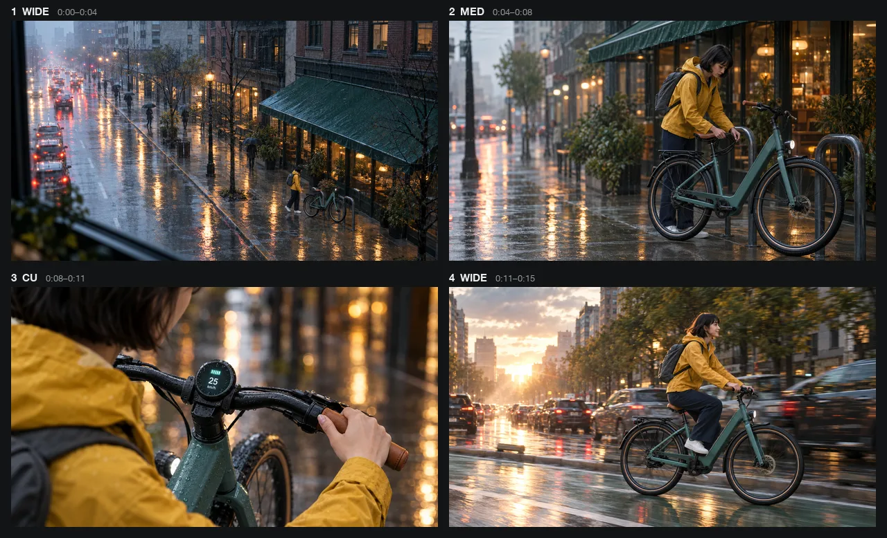

# AI Storyboard Generator Skill

[English](./README.md) | 简体中文

把剧本、场景或广告创意说明拆成可执行的分镜表，并制作一至四张关键分镜图，在 Claude Code、Codex 或 OpenClaw 里直接完成。

> [!IMPORTANT]
> 生成需要 [Beatra](https://beatra.ai) 账号并消耗积分，安装本身不收费。

| 问题 | 回答 |
| --- | --- |
| **能做什么** | 将剧本、场景或广告创意说明拆成可执行的分镜表，并制作一至四张关键分镜图。 |
| **运行要求** | Python 3.10+，以及能加载 `SKILL.md` 的 Agent |
| **费用** | 安装免费。每次生成消耗 Beatra 账号积分，只有你明确要求这次生成或批准确认卡后才会付费。 |
| **支持的 Agent** | Claude Code、Codex、OpenClaw |

<p align="center"></p>

*为虚构通勤电助力自行车 Voltline 制作的 15 秒广告四镜头分镜，从雨天清晨的大全景到日出时骑车穿过车流，每一格都是同一位骑手和同一辆车。由 Beatra AI 生成。*

| Skill | Entry point | Version |
| --- | --- | --- |
| [`ai-storyboard-generator`](skills/ai-storyboard-generator) | [SKILL.md](skills/ai-storyboard-generator/SKILL.md) | 0.2.0 |

本仓库由 [beatra-ai/beatra-skills](https://github.com/beatra-ai/beatra-skills/tree/main/skills/ai-storyboard-generator) 自动发布，问题请到那里反馈。

## 安装

使用 [`skills`](https://skills.sh) CLI：

```bash
npx skills add beatra-ai/ai-storyboard-generator-skill
```

使用 GitHub CLI：

```bash
gh skill install beatra-ai/ai-storyboard-generator-skill ai-storyboard-generator
```

也可以克隆本仓库，把 `skills/ai-storyboard-generator` 复制到 `~/.claude/skills/`（Claude Code）、`~/.agents/skills/`（Codex）或 `~/.openclaw/skills/`（OpenClaw）。

或者把下面这段话发给你的 Agent：

```text
从 https://github.com/beatra-ai/ai-storyboard-generator-skill 安装 ai-storyboard-generator skill（目录 skills/ai-storyboard-generator），然后按它的 SKILL.md 连接我的 Beatra 账号。
```

## 你能得到什么

- **先规划，再出图** — 在制作视觉帧前明确故事节拍、景别、构图、机位、时长、台词和声音，减少方向反复。
- **只制作关键镜头** — 从完整镜头表中选择一至四个最需要视觉对齐的镜头，让分镜保持聚焦、易审阅。

## 适用场景

- **短片与竖屏短剧** — 把一个场景拆成连续镜头，明确节拍、机位、时长和衔接关系。
- **广告创意提案** — 围绕产品信息、开场钩子、核心动作和收尾画面，建立可比较的视觉路径。
- **动画与创意提案** — 在扩大制作前确认构图、角色位置、场景和视觉节奏。

## 常见问题

### 必须提供完整剧本吗？

不需要。场景大纲、广告创意说明或故事概念也可以，只要包含核心动作、目标受众和预期形式。

### 可以制作多少张分镜图？

流程会先规划完整镜头表，再为选定的一至四个关键镜头分别制作分镜图。

### 可以使用角色或场景参考图吗？

可以。请按顺序提供并说明每张参考图的用途，便于关键帧延续预期的视觉方向。

## 更新

安装后的 skill 每天最多检查一次新版本，替换前先校验官方归档，任何一步失败都不会动你已安装的版本。
随时可以关闭，见 skill 内的 `references/automatic-updates-and-safety.md`。

## 许可证

[MIT-0](LICENSE)：可自由使用、修改和再分发，包括商用，无需署名；与这些 skill 在 ClawHub 上的条款一致。
